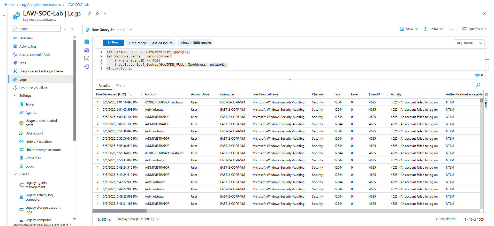
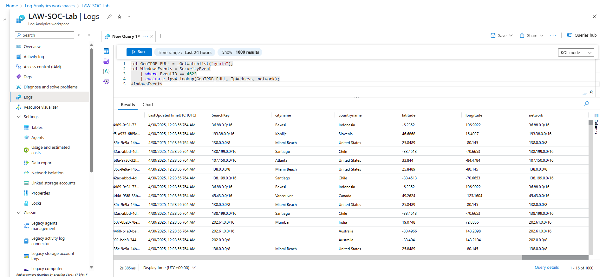
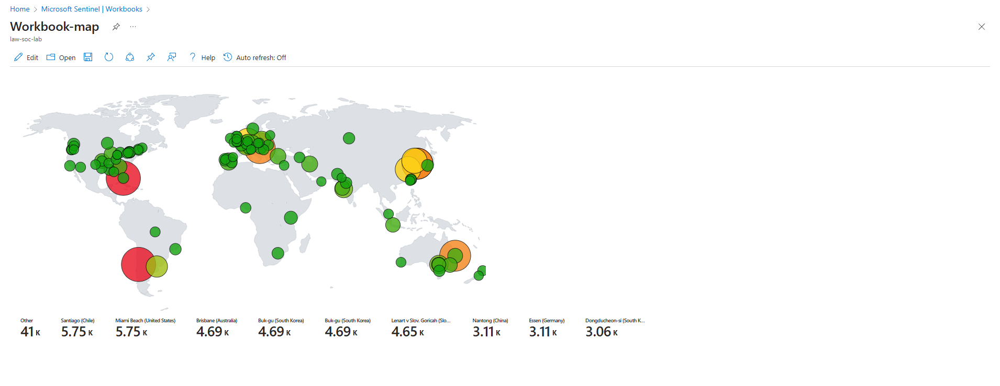

# 🛡️ Cyber Home Lab: Build a Honeypot, Catch Attackers, and Analyze Logs with Microsoft Sentinel

In this project, I created a functional **Cybersecurity Home Lab** in Microsoft Azure using **Microsoft Sentinel** and **Log Analytics Workspace**. This lab allowed me to deploy a honeypot, simulate brute-force login attacks, ingest logs, enrich those logs with geographic data, and build an **interactive attack map**. This walkthrough is designed to document each step I took, both as a personal reference and as a public portfolio piece.

---

## 🚀 Part 1: Setting up an Azure Subscription

Before deploying any resources, I created a Microsoft Azure account using the [Azure Free Subscription](https://azure.microsoft.com/en-us/pricing/purchase-options/azure-account).

Once set up, I logged into the [Azure Portal](https://portal.azure.com).

---

## 🛡️ Part 2: Creating the Honeypot (Windows 10 VM)

To simulate an attack target, I deployed a **Windows 10 Virtual Machine (VM)** in Azure.

### Steps:
1. In the Azure portal, search for "Virtual Machines" and click **Create**.
2. Choose a convincing name for the VM (I went with EAST-2-COPR-VM)
3. Choose the location of the VM (I went with East US 2 for all the resources)
4. Choose **Windows 10** as the OS.
5. Select a cost-effective size (e.g., I choose to go with Standard B2ms).
6. Set a secure username and password and save these.
7. Once created, under **Networking → Network Settings**, create a **Network Security Group (NSG)** rule to allow **all inbound traffic** from **any source or port** (this simulates a vulnerable public server).
8. After deployment, **log into the VM** via RDP.

### 🔥 Important:
- Once inside, I turned off the **Windows Firewall**:  
  `Start -> wf.msc -> Properties -> Turn Off all profiles`.

This makes the machine more exposed for the honeypot simulation.

---

## 🔍 Part 3: Simulating Attacks and Viewing Logs

With the VM running:

### 🧪 Simulate Attack:
- I intentionally failed **three login attempts** using an incorrect username (e.g., `admin`).
- Then, I successfully logged in to simulate a real user.

### 🧾 View Logs:
- Open **Event Viewer**.
- Navigate to: `Windows Logs -> Security`.
- Look for **Event ID 4625** (failed login attempts).

This proves that brute-force attempts are logged and can be monitored.

---

## 📊 Part 4: Centralized Logging with Sentinel + Log Analytics Workspace

### 1. Create a **Log Analytics Workspace (LAW)**:
- In Azure, search for “Log Analytics Workspaces” → Create new → Name it appropriately.

### 2. Set up **Microsoft Sentinel**:
- Search “Microsoft Sentinel” → Create a new Sentinel instance → Attach it to the LAW you created.

### 3. Connect the Data Source:
- Use the **Windows Security Events via AMA** connector.
- This connects the VM’s event logs (like Event ID 4625) to Sentinel.

### 4. Querying Logs using KQL:
Inside Sentinel (or LAW), I wrote Kusto Query Language (KQL) queries like:

```kql
SecurityEvent
| where EventID == 4625
```

## 🌍 Part 5: Log Enrichment with Geolocation

While logs showed **IP addresses**, they lacked location info.

### 🗺️ Solution: Use a GeoIP Watchlist

1. Download the `geoip-summarized.csv` file (contains IP blocks and geo info).
2. In Sentinel → **Watchlists** → Create a new Watchlist:
   - Name: `geoip`
   - Source Type: Local File
   - Key Column: `network`
   - Upload CSV and wait for ~55,000 rows to import.

### 🔍 Update KQL Query

```kql
let GeoIPDB_FULL = _GetWatchlist("geoip");
let WindowsEvents = SecurityEvent
    | where EventID == 4625
    | evaluate ipv4_lookup(GeoIPDB_FULL, IpAddress, network);
WindowsEvents
```

This query matches attacker IPs to geographic data using CIDR block lookup.




---

## 🗺️ Part 6: Building a Live Attack Map (Sentinel Workbook)

With enriched logs in place, I visualized attacks on a **map-based dashboard**.

### Steps:
1. In Sentinel, go to **Workbooks** → Create New.
2. Delete pre-filled content.
3. Add a **Query** element.
4. Switch to **Advanced Editor** and the **JSON template** (`map.json`).

The result: a dynamic map showing where brute-force login attempts were originating from geographically.



---

## 🎯 Key Takeaways

- **Microsoft Sentinel** is a powerful SIEM tool.
- KQL is essential for querying logs at scale.
- Geolocation enrichment adds major value for threat intelligence.
- Visual dashboards communicate threats more effectively.
- This lab simulates a **real-world detection pipeline** — from event generation to visualization.

---

## 🧹 Teardown: Shutting Down to Avoid Charges

After completing the lab, it's **crucial to clean up your resources** to avoid unexpected Azure charges.

### 🔻 Steps to Decommission Your Lab:

1. **Stop or Delete Your Virtual Machine**
   - Go to Azure Portal → Virtual Machines
   - Select your VM and click **Stop** or **Delete**

2. **Remove Network Security Rules**
   - Go to the Network Security Group attached to your VM
   - Delete any rules that allowed unrestricted inbound traffic

3. **Delete Log Analytics Workspace**
   - Azure Portal → Log Analytics Workspaces
   - Select the workspace you created and delete it

4. **Delete Microsoft Sentinel Instance**
   - Go to Microsoft Sentinel → Configuration
   - Remove your workspace from Sentinel, then delete the instance

5. **Delete Watchlists and Workbooks**
   - Delete the `geoip` Watchlist from Sentinel
   - Remove any custom Workbooks you created

6. **Double-check your Azure Subscription**
   - Go to the **Cost Management** dashboard
   - Make sure no services are still running that could incur costs
